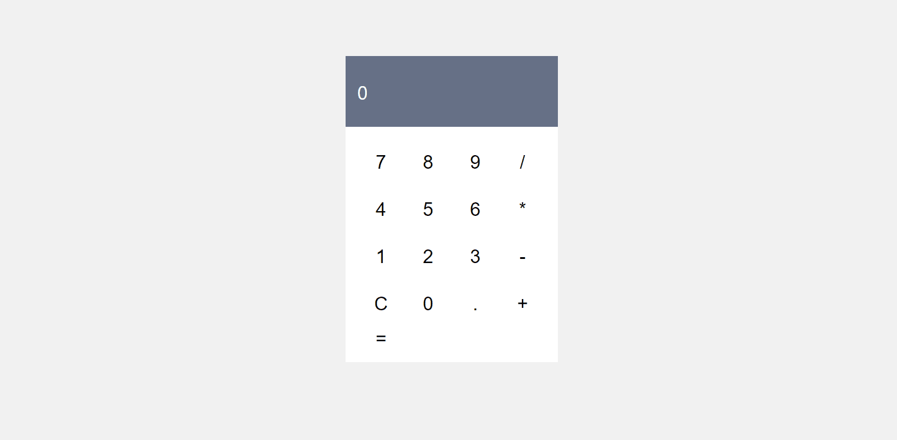

# React Calculator

A simple calculator built with ⚛ React ⚛ as part of the FreeCodeCamp Front-end certification. Specification for this project can be found [here](https://learn.freecodecamp.org/front-end-libraries/front-end-libraries-projects/build-a-javascript-calculator).

[Live Demo](https://mattldwig.github.io/react-calculator/)

---

## Installation

* Clone the repo `git clone https://github.com/MattLdwig/react-calculator.git`
* Navigate to folder `cd react-calculator`
* Install dependencies `npm install`
* Start with `npm start` and open [http://localhost:3000] to view it in the browser.

---

## Todo

- [ ] Allow keyboard use
- [ ] Automatically adjust the font size according to the number of digits in display area
- [ ] Integrated advanced functions (modulo, percentage...)

### License

This project was bootstrapped with [Create React App](https://github.com/facebook/create-react-app) and [licensed as MIT](./License.md).

